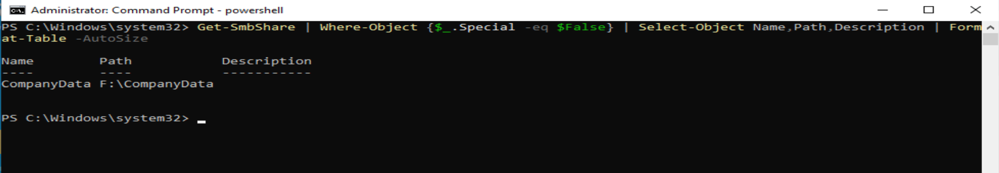
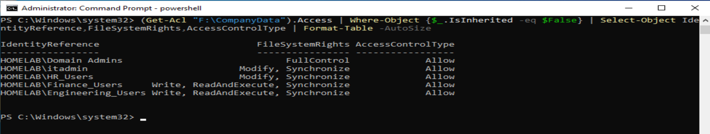
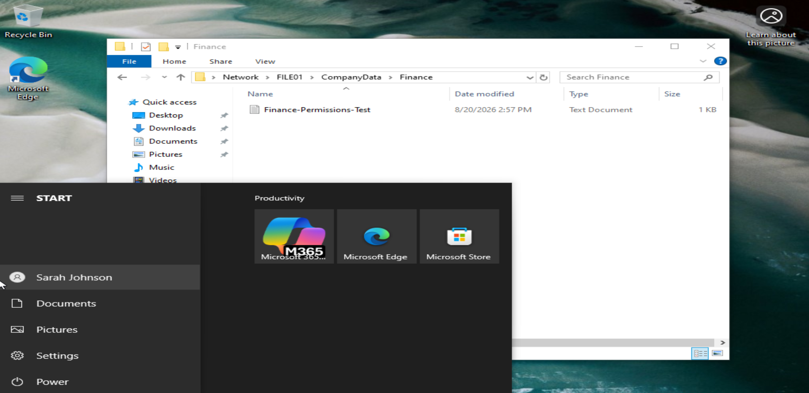

# FILE01 — Enterprise File Services

## Overview

FILE01 provides centralized file services for the `homelab.local` Active
Directory environment.

The server hosts the `CompanyData` SMB share used by departmental users
and demonstrates role-based access control using Active Directory security
groups, SMB share permissions, and NTFS permissions.

The implementation was validated from a domain-joined Windows 10 client
using multiple domain user accounts to confirm both authorized and
unauthorized access behavior.

---

## Server Role

FILE01 provides the following services:

- Centralized SMB file sharing
- Departmental data storage
- NTFS access control
- Active Directory group-based authorization
- IIS web services
- HTTPS using an internally issued certificate

FILE01 is integrated with the `homelab.local` Active Directory domain and
uses domain identities and security groups for resource authorization.

---

## Storage Configuration

A dedicated `F:` volume is used for company file storage.

The primary shared directory is:

`F:\CompanyData`

The `CompanyData` directory contains departmental folders including:

- Engineering
- Finance
- HR
- Marketing
- Public

A `ServerInfo` text file is also stored within the CompanyData directory.

Using a separate data volume keeps shared organizational data separate
from the Windows operating system volume.

---

## SMB Share Configuration

The primary network share is:

`\\FILE01\CompanyData`

The underlying directory is:

`F:\CompanyData`

The SMB share provides the network entry point to the departmental folder
structure.

Share permissions were configured with:

- `Everyone` — Full Control

Access restrictions are then enforced primarily through NTFS permissions
on the departmental directories.

This design allows the share to provide access to the namespace while
NTFS permissions determine which resources each authenticated domain user
can access.

---

## Active Directory Group-Based Access Control

Departmental access is assigned through Active Directory security groups
rather than by granting permissions directly to individual users.

Examples include:

- `Engineering_Users`
- `Finance_Users`
- `HR_Users`
- `Marketing_Users`

Departmental folders are assigned permissions corresponding to their
respective security groups.

For example, the Engineering directory grants the
`HOMELAB\Engineering_Users` group permissions required to work with files
within that department without granting Full Control.

This provides centralized role-based access management because access can
be changed by modifying Active Directory group membership rather than
reconfiguring individual file permissions.

## Departmental Folder Structure

The CompanyData share presents a common organizational namespace:

`\\FILE01\CompanyData`

Users can enumerate the departmental folder structure while access to the
contents of protected departmental folders is controlled through NTFS
authorization.

This allows users to locate shared resources while preventing unauthorized
access to departmental data.

---

## Windows 10 Client Validation

FILE01 access controls were validated from a domain-joined Windows 10
workstation using multiple Active Directory user accounts.

Testing included:

- Network connectivity to FILE01
- Access to `\\FILE01\CompanyData`
- Enumeration of the CompanyData folder structure
- Authorized departmental folder access
- File creation within authorized folders
- Access attempts against unauthorized departmental folders
- Public folder access

Both successful and denied access were intentionally tested.

---

## Sarah Johnson Access Validation

Testing performed while authenticated as Sarah Johnson confirmed that the
Windows 10 client could connect to FILE01 and access the CompanyData share.

The client successfully enumerated:

- Engineering
- Finance
- HR
- Marketing
- Public

Authorization testing demonstrated different behavior depending on the
departmental resource.

### Finance

Sarah Johnson successfully accessed the Finance directory and created a
test file.

This confirmed effective write access to the authorized departmental
resource.

### Public

Sarah Johnson successfully accessed the Public directory and created a
test file.

This confirmed that the shared Public resource was available as designed.

### Engineering

An attempt to access:

`\\FILE01\CompanyData\Engineering`

returned a Windows access-denied message.

This confirmed that visibility of a folder within the shared namespace
does not automatically grant access to its contents.

---

## Sarah Davis Access Validation

A second domain user was used to confirm that FILE01 authorization changes
according to the user's Active Directory group membership.

### HR

Sarah Davis successfully accessed the HR directory and created a test
file.

This confirmed effective write access to her authorized departmental
resource.

### Public

Sarah Davis successfully accessed the Public directory and created a test
file.

### Finance

An attempt to access:

`\\FILE01\CompanyData\Finance`

returned a Windows access-denied message.

This provided negative authorization testing and demonstrated that Sarah
Davis could not access a departmental resource for which she was not
authorized.

---

## Authorization Validation Summary

Client testing demonstrated the intended relationship between Active
Directory identities, security groups, and FILE01 permissions.

The authorization path can be summarized as:

`Domain User → AD Security Group → NTFS Permissions → FILE01 Resource Access`

Successful access tests confirmed that authorized users could work with
their departmental resources.

Access-denied tests confirmed that users could not access protected
departmental resources outside their assigned authorization.

Testing both conditions was important because successful access alone
would not demonstrate that the access-control boundaries were functioning
correctly.

---

## IIS and HTTPS

FILE01 also hosts IIS and provides HTTPS connectivity using:

`https://file01.homelab.local`

The HTTPS service uses TCP port 443 and a certificate issued by the
internal enterprise certification authority.

The server certificate identifies:

`file01.homelab.local`

and was issued by:

`HOMELAB-Root-CA`

HTTPS was validated from the Windows 10 domain client by connecting to
FILE01 through its fully qualified domain name and inspecting the
certificate presented by the server.

This demonstrates integration between:

`Active Directory DNS → FILE01 → IIS → Enterprise PKI → Windows Client`

---

## Security Design

The FILE01 implementation demonstrates several enterprise file-services
principles:

- Centralized network file storage
- Dedicated data storage
- Active Directory-based authentication
- Security-group-based authorization
- NTFS least-privilege access control
- Separation of share and NTFS permissions
- Departmental access boundaries
- Positive and negative authorization testing
- DNS-based server access
- Internal PKI integration
- HTTPS-protected IIS services

Access is managed through security groups instead of individual user
permissions, making the environment easier to administer and scale.

---

## Validation Results

FILE01 was successfully validated as a domain-integrated enterprise file
server.

Testing confirmed that:

- Domain clients can resolve and communicate with FILE01.
- `\\FILE01\CompanyData` is accessible to authorized domain users.
- Departmental resources are protected using NTFS permissions.
- Active Directory group membership controls departmental authorization.
- Authorized users can create files within permitted resources.
- Unauthorized departmental access is denied.
- Public resources remain available as designed.
- IIS is reachable through `https://file01.homelab.local`.
- FILE01 presents a certificate issued by the internal enterprise CA.

These results demonstrate functional integration between Active Directory,
DNS, SMB, NTFS authorization, IIS, enterprise PKI, and the Windows 10
client environment.