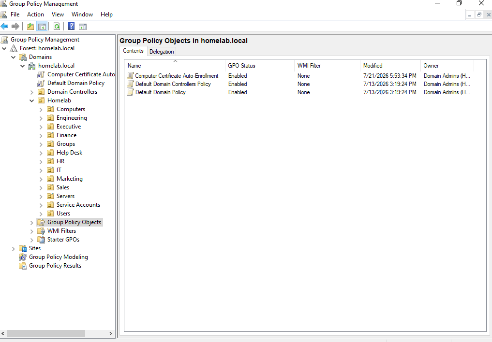
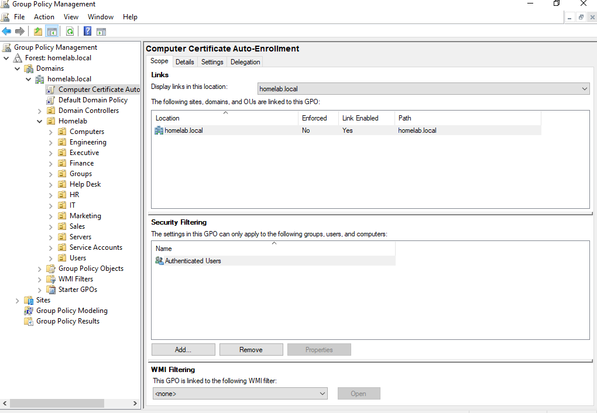

# Group Policy — Certificate Auto-Enrollment

## Overview

Group Policy is used in the `homelab.local` Active Directory environment to centrally configure Windows systems and support enterprise certificate enrollment.

This portion of the project demonstrates the creation and deployment of a Group Policy Object (GPO) used to enable computer certificate auto-enrollment within the domain.

The configuration integrates:

- Active Directory Domain Services
- Group Policy
- Active Directory Certificate Services
- Enterprise certificate templates
- Domain-joined Windows systems

---

## Environment

| Component | Configuration |
|---|---|
| Domain | `homelab.local` |
| Domain Controller | `DC01` |
| Group Policy Management | Group Policy Management Console |
| Certificate Server | `PKI01` |
| Certification Authority | `HOMELAB-Root-CA` |
| Policy Purpose | Computer certificate auto-enrollment |

---

## Group Policy Objects

The Group Policy Management Console was used to review the GPOs configured within the `homelab.local` environment.

In addition to the default domain policies, the environment contains a custom Computer Certificate Auto-Enrollment GPO.

The custom policy is:

```text
Computer Certificate Auto-Enrollment
```

This policy provides centralized configuration for computer certificate enrollment through the HomeLab enterprise PKI.



---

## Computer Certificate Auto-Enrollment

The `Computer Certificate Auto-Enrollment` GPO was created to centrally configure certificate auto-enrollment for domain systems.

The GPO is enabled and linked at the `homelab.local` domain level, allowing the policy to be applied through the Active Directory domain hierarchy.

The GPO scope was verified in Group Policy Management:

- GPO Status: Enabled
- Linked Location: `homelab.local`
- Link Enabled: Yes
- Enforced: No
- Security Filtering: Authenticated Users
- WMI Filtering: None

This configuration provides the Group Policy framework used to integrate domain systems with the HomeLab Active Directory Certificate Services infrastructure.

