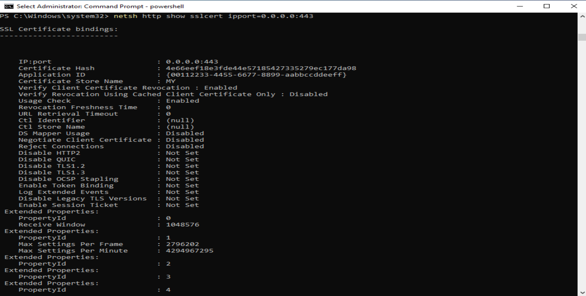
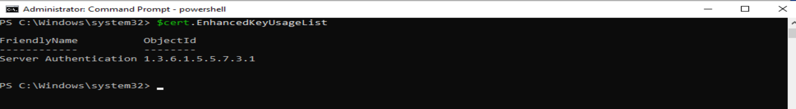
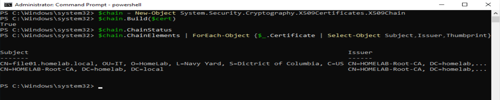
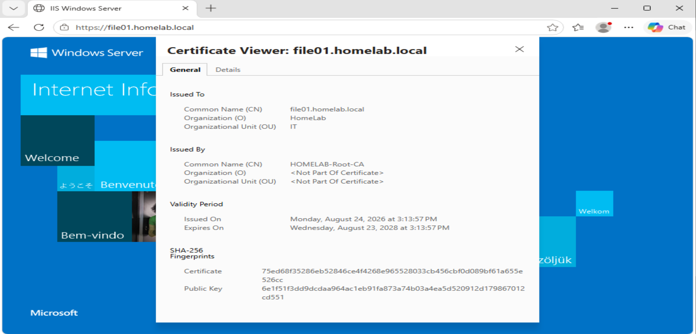

# IIS/HTTPS — FILE01

## Overview

FILE01 hosts Internet Information Services (IIS) and was configured to provide HTTPS using a certificate issued by the HomeLab internal Public Key Infrastructure (PKI).

This implementation connects several components of the lab:

- Active Directory-integrated DNS
- Active Directory Certificate Services (AD CS)
- Custom certificate templates
- Certificate enrollment
- IIS
- HTTP.sys SSL certificate bindings
- Windows client certificate validation

The completed configuration allows a domain client to securely access:

`https://file01.homelab.local`

## Environment

- Domain: `homelab.local`
- Web Server: `FILE01`
- Web Server FQDN: `file01.homelab.local`
- Certification Authority: `HOMELAB-Root-CA`
- Certificate Server: `PKI01`
- Client: `Windows10`
- Protocol: HTTPS
- Port: TCP 443

## Certificate Deployment

FILE01 was issued a server authentication certificate from the internal `HOMELAB-Root-CA`.

The certificate was installed in the Local Computer personal certificate store and included the corresponding private key.


## HTTPS Certificate Binding

The server certificate was bound to TCP port 443 using the Windows HTTP service configuration.

The SSL certificate binding was verified with:

```powershell
netsh http show sslcert
```



## Server Authentication Validation

The FILE01 certificate was verified to include the **Server Authentication** Enhanced Key Usage (EKU).

This confirms that the certificate is intended for authenticating a TLS-enabled server such as the IIS web service.

```text
Enhanced Key Usage:
Server Authentication
```



## Certificate Chain Validation

The FILE01 web server certificate was validated to confirm that Windows could successfully build the certificate trust chain.

The validation path was:

```text
file01.homelab.local
        ↓
HOMELAB-Root-CA
```

Certificate-chain validation completed successfully with no chain-status errors.

This confirms that the FILE01 server certificate chains successfully to the trusted HomeLab Root Certification Authority.



## Windows 10 HTTPS Validation

The completed HTTPS configuration was tested from the domain-joined Windows 10 client.

The client connected to:

```text
https://file01.homelab.local
```

The IIS page was successfully reached over HTTPS, and the certificate presented by FILE01 identified:
- **Issued To:** `file01.homelab.local`
- **Issued By:** `HOMELAB-Root-CA`

This validated the completed path from the domain client to the IIS service using the certificate issued by the internal PKI.

