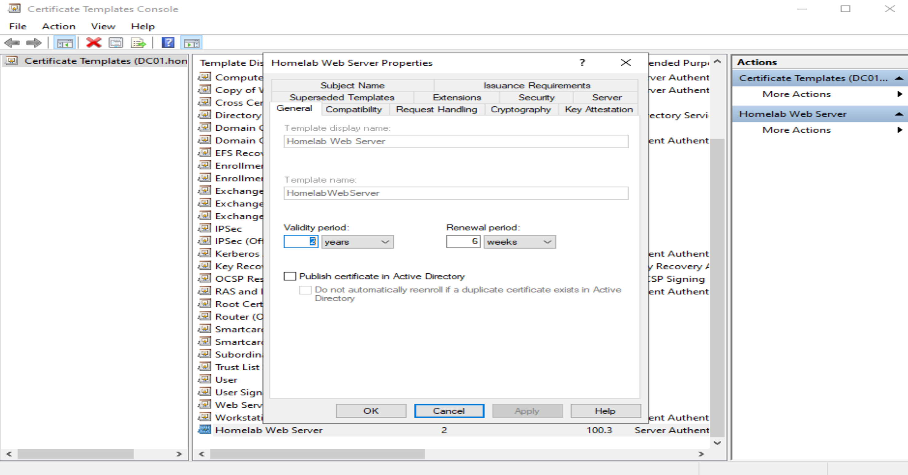
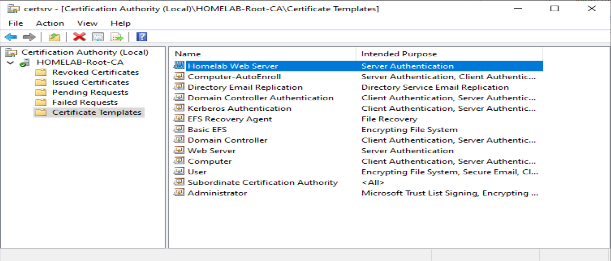
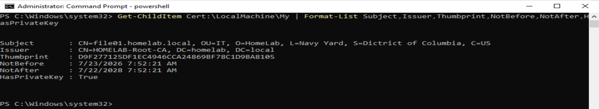

# PKI01 - Active Directory Certificate Services

## Overview

PKI01 provides enterprise certificate services for the HomeLab Windows domain using Microsoft Active Directory Certificate Services (AD CS).

The certificate infrastructure is used to issue and manage certificates for domain systems and services. As part of this implementation, a custom web server certificate template was configured and used to secure IIS on FILE01 with HTTPS.

## Environment

- Domain: `homelab.local`
- Certification Authority: `HOMELAB-Root-CA`
- Certificate Server: `PKI01`
- Web Server: `FILE01`
- Client Validation: `Windows10`
- Certificate Template: `Homelab Web Server`

## Implementation

### 1. Custom Web Server Certificate Template

A custom certificate template named `Homelab Web Server` was configured for server authentication.

### 2. Certificate Template Publication

The `Homelab Web Server` template was published through the `HOMELAB-Root-CA`, making it available for certificate enrollment.

### 3. FILE01 Certificate Enrollment

FILE01 was issued a server certificate by the internal certification authority.

The certificate uses:

- Subject: `CN=file01.homelab.local`
- Issuer: `HOMELAB-Root-CA`
- Private key: Present
- Intended use: Server Authentication

## Troubleshooting

During certificate enrollment, an initial request failed because conflicting certificate template information was supplied. The request referenced both the default `WebServer` template and the custom `HomelabWebServer` template.

The certificate request configuration was corrected so that enrollment used the intended custom template. After correcting the request, the CA issued the certificate successfully and the certificate was installed on FILE01.

This troubleshooting demonstrated the relationship between certificate request configuration, certificate templates, CA policy, and certificate enrollment.

## Result

The custom certificate template was successfully published, FILE01 successfully enrolled for a server certificate, and the certificate was subsequently used to secure the IIS web service with HTTPS.

The HTTPS implementation and client-side validation are documented separately in the `iis-https` section of this repository.