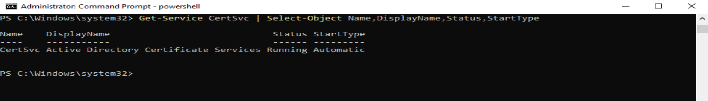
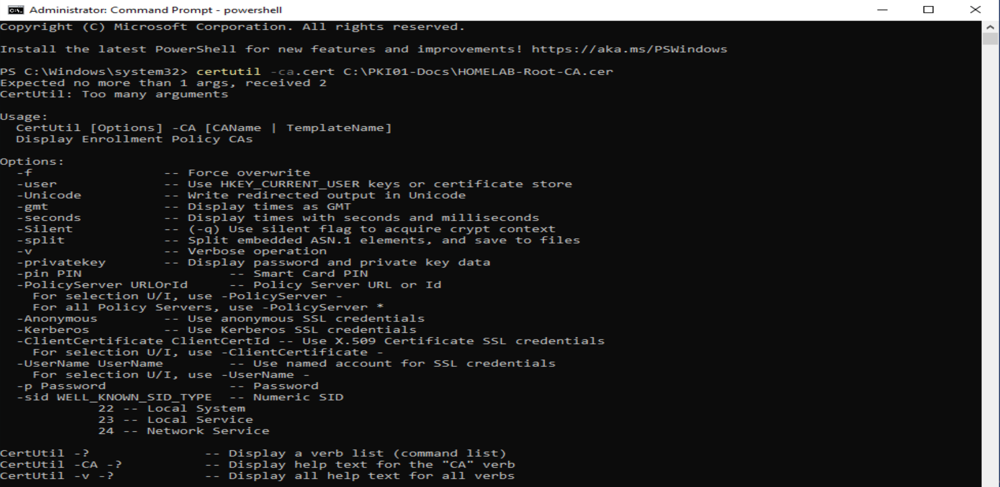
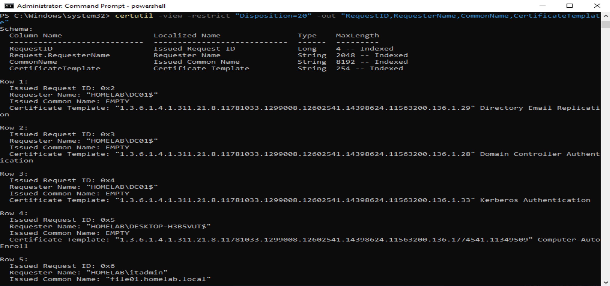
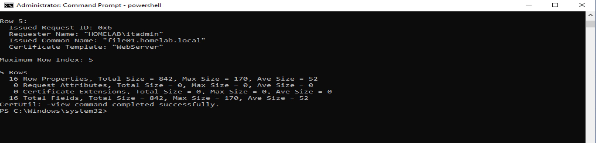
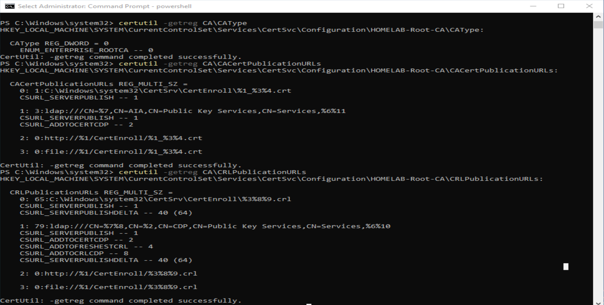
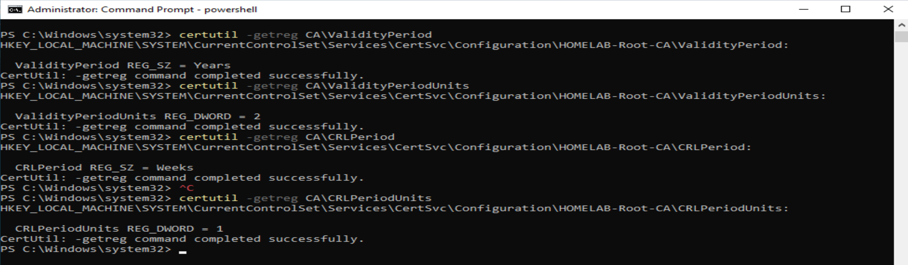
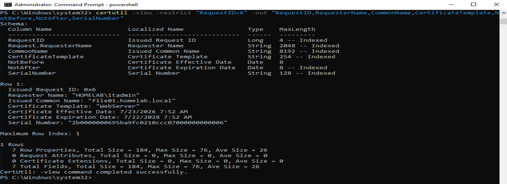
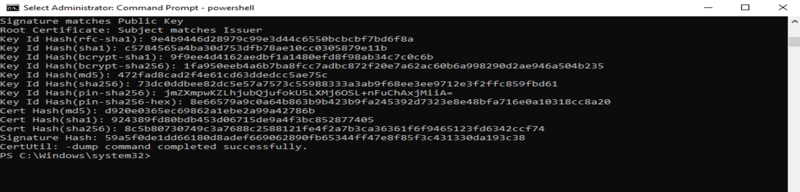
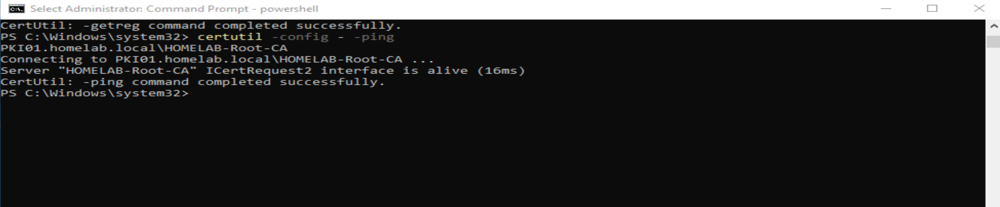

# PKI01 — Active Directory Certificate Services

## Overview

PKI01 provides certificate services for the `homelab.local` Windows enterprise environment using Microsoft Active Directory Certificate Services (AD CS).

The server functions as the internal Enterprise Root Certification Authority and issues certificates used by domain systems and services.

This portion of the project demonstrates:

- Active Directory Certificate Services
- Enterprise Root CA deployment
- Certificate templates
- Certificate enrollment
- Certificate issuance
- Certificate trust
- Certificate chain validation
- Certificate revocation configuration
- IIS HTTPS integration

---

## Environment

| Component | Configuration |
|---|---|
| Certificate Server | `PKI01` |
| Domain | `homelab.local` |
| Certification Authority | `HOMELAB-Root-CA` |
| CA Type | Enterprise Root CA |
| Web Server | `FILE01` |
| Client Validation | Windows 10 |
| Web Certificate FQDN | `file01.homelab.local` |

PKI01 is joined to the Active Directory domain and uses the internal domain DNS infrastructure.

---

## Active Directory Certificate Services

The Active Directory Certificate Services role and Certification Authority role service were installed on PKI01.

The AD CS service was verified as:

- Service: `CertSvc`
- Display Name: Active Directory Certificate Services
- Status: Running
- Startup Type: Automatic

This confirms that certificate services are actively running rather than merely installed.



---

## Enterprise Root Certification Authority

PKI01 hosts the internal:

```text
HOMELAB-Root-CA
```

The CA operates as the Enterprise Root Certification Authority for the `homelab.local` environment.

The Root CA certificate establishes the internal trust anchor used by domain systems to validate certificates issued by the HomeLab PKI.



## Certificate Template Configuration

A certificate template was configured for the HomeLab web server deployment.

The template provides the certificate configuration required for the IIS service on FILE01 and allows the internal PKI to issue a server certificate for:

`file01.homelab.local`

This demonstrates the use of certificate templates to standardize certificate enrollment within the Active Directory environment.


## Certificate Template Publication

After the HomeLab web server certificate template was configured, it was published on `HOMELAB-Root-CA`.

Publishing the template makes it available through the Enterprise Certification Authority for certificate enrollment and issuance.

This connects the configured certificate template to the CA that services certificate requests within the `homelab.local` environment.


## Certificate Issuance

The `HOMELAB-Root-CA` Certification Authority database was queried with `certutil` to verify successful certificate issuance within the `homelab.local` environment.

The issued-certificate database contains certificate requests from domain systems as well as the certificate issued for the FILE01 web service.

```text
Issued Common Name: "file01.homelab.local"
Certificate Template: "WebServer"
```

This confirms that PKI01 successfully processed the certificate request and issued a web server certificate for `file01.homelab.local`.





## CA Publication Configuration

The `HOMELAB-Root-CA` publication configuration was reviewed to verify the locations used by the Certification Authority for certificate and revocation information.

These publication settings support certificate validation by providing the locations Windows systems use when building certificate chains and checking revocation information.



## CA Validity and CRL Configuration

The `HOMELAB-Root-CA` configuration was reviewed to verify certificate validity and Certificate Revocation List (CRL) settings.

CRLs provide a mechanism for clients to determine whether a certificate issued by the Certification Authority has been revoked before its normal expiration date.

Maintaining CA validity and revocation settings is an important part of the certificate lifecycle and supports reliable certificate validation throughout the `homelab.local` environment.



## FILE01 Web Server Certificate

PKI01 was used to issue a web server certificate for the FILE01 IIS service.

The issued certificate identifies:

- Server: `FILE01`
- FQDN: `file01.homelab.local`
- Issuing CA: `HOMELAB-Root-CA`
- Purpose: Server Authentication
This demonstrates the practical use of the HomeLab PKI to provide certificate services for an internal enterprise application.



## Root CA Certificate Verification

The exported `HOMELAB-Root-CA` certificate was inspected with `certutil` to verify the Root Certification Authority certificate.

```powershell
certutil -dump C:\PKI01-Docs\HOMELAB-Root-CA.cer
```

Certificate inspection confirmed that the Root CA certificate is self-signed, with the certificate subject matching the issuer and the signature matching the public key.

```text
Signature matches Public Key
Root Certificate: Subject matches Issuer
```

This verifies the `HOMELAB-Root-CA` certificate as the root of trust for the internal HomeLab PKI.



## Certification Authority Connectivity

Connectivity to the Enterprise Certification Authority was tested to verify that the CA could be reached successfully within the domain environment.

```powershell
certutil -ping
```

Successful CA connectivity confirms that the Certification Authority service is accessible for certificate-related operations within the `homelab.local` environment.

